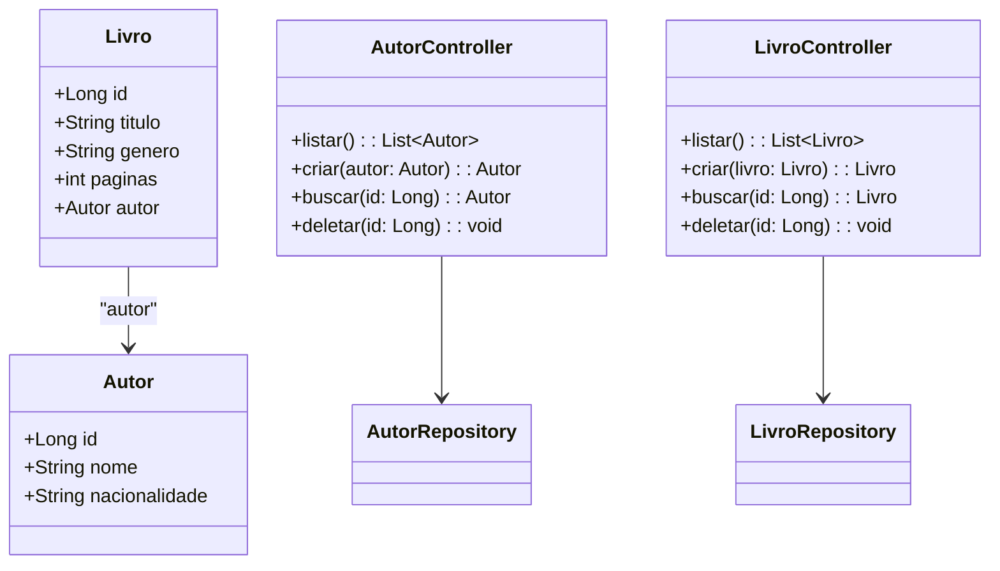

# 📚 Livros API

Desafio Dio Publicando Sua API REST na Nuvem. API RESTful desenvolvida com Java 17 e Spring Boot 3 para gerenciar um catálogo de livros e autores. A aplicação está preparada para deploy com Docker e hospedada na plataforma Render, utilizando banco de dados PostgreSQL.

## 🖊️ Diagrama de Classes

## 🚀 Tecnologias Utilizadas

- ✅ Java 17  
- ✅ Spring Boot 3  
- ✅ Spring Data JPA  
- ✅ PostgreSQL  
- ✅ Docker  
- ✅ Render (Deploy automatizado)  

## 📚 Endpoints da API

A API expõe os seguintes endpoints para gerenciamento de autores e livros:

#### 📖 Autores

| Método | Endpoint   | Descrição               |
|:-------|:-----------|:------------------------|
|GET     |/autores     |Lista todos os autores  |
|GET     |/autores/{id}|Retorna um autor pelo ID|
|POST	 |/autores     |Cria um novo autor      |
|DELETE	 |/autores/{id}|Deleta um autor pelo ID |

#### 📘 Livros

| Método | Endpoint   | Descrição              |
|:-------|:-----------|:-----------------------|
|GET	 |/livros	  |Lista todos os livros   |
|GET	 |/livros/{id}|Retorna um livro pelo ID|
|POST	 |/livros	  |Cria um novo livro      |
|DELETE	 |/livros/{id}|Deleta um livro pelo ID |

## 🔗 Acessar a API

Você pode acessar a API online através do seguinte link:

https://livrosapi.onrender.com

Esse link leva à versão publicada no Render. Para testar os endpoints, basta seguir as instruções de uso da API descritas nas seções anteriores.